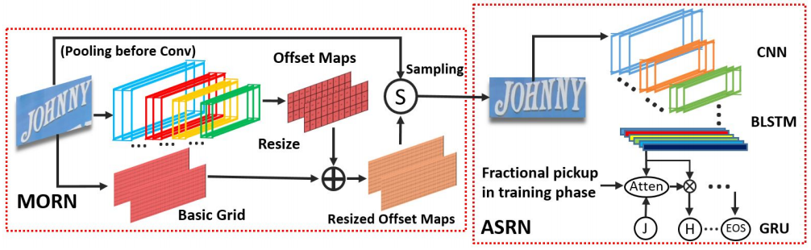
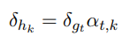
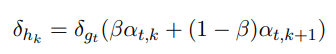
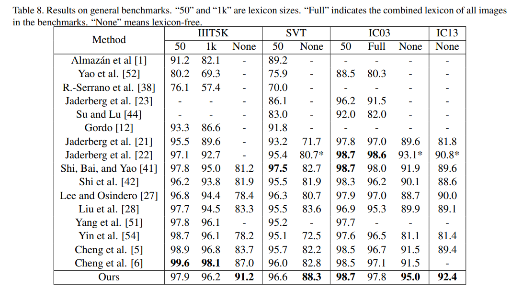
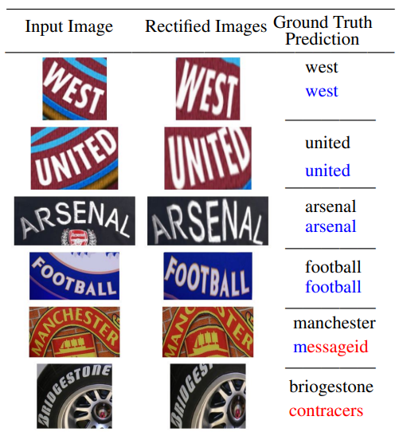

# MORAN: A Multi-Object Rectified Attention Network for Scene Text Recognition

https://arxiv.org/pdf/1901.03003.pdf

# 1.概述

端到端的识别模型，主要解决**不规则场景文本的识别**，MORAN网络由校正网络MORN，识别网络ASRN组成。在MORN中设计了一种**像素级弱监督学习机制**用于校正不规则文本，降低了不规则文本的识别难度

# 2.创新点

1. 弱监督方式进行训练，MORN网络只需要文字标签就可以进行校正，不需要坐标信息。可以校正复杂的失真图像，且不受几何约束。
2. 训练ASRN中基于attention的解码器时，提出了一种fractional pickup的方法，通过扩展网络的视野，解决噪声干扰，进一步提高解码器的灵敏度。

# 3.模型结构

## 3.1 校正网络Multi-Object Rectification Network

### 3.1.1 传统方法的局限性

仿射变换的局限性在几何约束上，仅限于旋转，缩放和平移。一张图片存在多种变形，传统方法无法涵盖所有复杂的变形。

### 3.1.2 不受几何约束的方法

可变形卷积，作者尝试在识别网络中加入可变形卷积，但是因为不规则文本识别具有很大的难度，网络有时会**无法收敛**，在IIIT5k数据集上的最好效果是78.1%（远低于sota的91.2%）

### 3.1.3 MORN网络

网络只预测**图像中每个像素点的位置偏移量(offset)**，不需要预测类别。

MORN模型结构如上图所示：先做pooling减小计算量和噪声；每一层卷积后（除最后一层）接bn和relu；

offset map: 输入图像为3 * 2 * 100，输出大小为2 * 3 * 11的offset map，然后用双线性差值恢复到原图大小(32*100)

basic grid: 将原图中每个像素的坐标标准化到[-1,1]。

将basic grid和 offset map相加，得到变换后的坐标

然后分别归一化到[0,W]和[0,H]

I'为校正后的图像，通过双线性差值从原图I中采样得到。

与仿射变换的比较

## 3.2 识别网络Attention-based Sequence Recognition Network

### 3.2.1 网络结构

CNN+BLSTM结构

需要固定最大序列长度T，当预测‘’EOS‘’ 时停止

### 3.2.2 Fractional Pickup

针对一些由于噪声干扰而产生的错误预测，提出了一种方法，Fractional Pickup

做法：对attention参数进行修改

优点：

**1.Variation of Distribution**

参数和相邻features有关，且具有随机性，即使对于同一张图片，每个step产生的贡献可能是不同的，增强了attention的鲁棒性，容易避免过拟合。

**2.Shortcut of Forward Propagation**

通过FP建立了一个从k+1步到k步的shortcut，它保留了之前step中的一部分特征。

**3.Broader Visual Field**

没有FP的情况下，特征向量的误差项只和一个固定的参数相关

加入了FP后，结果与当前和相邻的features都有关

## 3.3 训练策略

作者在训练时发现MORAN网络在训练时，两个子网络会相互阻碍，**导致训练不充分**，有两种情况：

1.ASRN训练很好，正确识别图像，MORN无法校正图像

2.ASRN不鲁棒，因为MORN校正图像效果很好

**因此采用一个three-step process来解决这个问题**

**第一个阶段**：**用规则样本训练ASRN**。样本有紧凑的文本框，可以从大图中取出文本框。然后用最小外接矩形裁剪文本框，得到不规则样本

**第二个阶段：**固定ASRN的参数，用ASRN来引导MORN**训练不规则样本**。如果MORN对图像的校正不好，没有降低不规则文本识别难度，那么MORN的优化无法进行。只有降低识别难度才能为MORN提供正面反馈。

**第三个阶段：**把ASRN和MORN合起来训练

## 4.实验结果

1.环境配置：pytorch，CUDA8.0，CuDNN v7，gtx1080ti

2.识别速度：10.4ms 识别字符长度为5的图片

## 5.缺点

弯曲角度过大时，校正会失败

